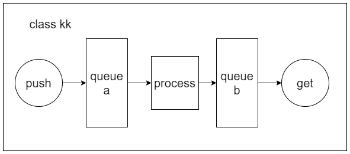

# ProcessingThreadClass

This is a sketch of a thread processing class. I intended to program a ViT inference demo at first but I extract the general construction of such tasks. It shows like below:

- using thread, queue, atomic, mutex, condition_variable

Maybe the "process" section has multiple steps and needs to be splitted in order to build a pipeline. This part can be customized.

